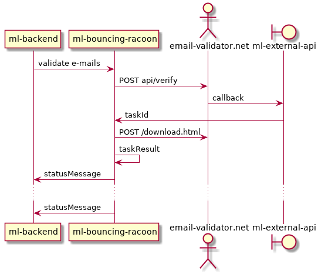

# ML Bouncing Racoon


## Introduction

> We placed your SES account under review. 
> You can still use this account to send email, 
> but you should fully address the problems that led to your account being placed under review. 
> If you don't address these issues by the end of the review period, 
> we'll temporarily pause your account's ability to use SES to send email until you resolve these issues.
> 
> Your current bounce rate is 11.08%. 
> We recommend that you maintain a bounce rate below 5%. 
> If your bounce rate exceeds 10%, we might pause your ability to send additional email.
>
> — ses-review@amazon.com

http://docs.aws.amazon.com/ses/latest/DeveloperGuide/best-practices-bounces-complaints.html

[](doc/context.plantuml)

## Local development

You can start the required Docker containers with the following command:

`(cd ~/src/ml-bouncing-racoon/docker && docker-compose up -d)`

Then you can start RacoonApplication from the IDE.
Alternatively you can use the following command to run all containers:

`(cd ~/src/ml-bouncing-racoon/docker && docker-compose -f docker-compose-run-all.yaml up -d)`

### Code packages

* de.magicline.racoon.api
* de.magicline.racoon.config
* de.magicline.racoon.job
* de.magicline.racoon.domain (provider, task, status)

[](doc/packages.plantuml)

### Tests

* unit: *Test.java
* integration: *IT.java
* web: *.http (for IntelliJ)

Known issues: 

* `@MockBean`/`@TestConfiguration` doesn't work when all tests run. Workaround: `@DirtiesContext` for other IT.
* Integration Tests require running DB and MQ (see Docker containers). 
* Integration Tests require not running application (MQ listeners race). 

## Database

Access to the DEV database is via the Jump Server:

`ssh ubuntu@jump.internal.magicline.com`

`PGPASSWORD=igA6gAfQDzzTYZWmydkKptJy psql ml-db-bouncingracoon.cwwu8vfqevzy.eu-west-1.rds.amazonaws.com -U racoon_dev`

## Communication

### RabbitMQ

Exchange: **ml.racoon**, Bindings:

|Role    |To queue                         |Routing key
|---|---|---	
|in      |ml.racoon.validation             |validation	
|internal|ml.racoon.task                   |task
|out     |ml.racoon.status.indeterminate   |status.indeterminate	
|out     |ml.racoon.status.invalid         |status.invalid	
|out     |ml.racoon.status.suspect         |status.suspect	
|out     |ml.racoon.status.valid           |status.valid

Exchange: **ml.racoon.dlx**, Bindings:

|To queue                  |Routing key
|---|---	
|ml.racoon.validation.dlq  |validation	
|ml.racoon.task.dlq        |task

See also [Web Console](http://localhost:15672)

See also [Docker](/docker/docker-compose.yaml)
### External communication

RTEV callbacks `GET /racoon/tasks/callbacks?taskid=<taskId>`

### Swagger (WIP)
* [LOCAL](http://localhost:8107/swagger-ui.html)
* [DEV](https://bouncing-racoon.dev.magicline.com/swagger-ui.html)
* [STAGE](https://bouncing-racoon.stage.magicline.com/swagger-ui.html)
* [PROD](https://bouncing-racoon.magicline.com/swagger-ui.html)

### Mocks

[HTTP client in IDE](https://www.jetbrains.com/help/idea/http-client-in-product-code-editor.html)

[mock.http](/src/test/http/mock.http)

### Real-Time Email Validation API

https://www.email-validator.net/api.html

#### Limits

* Up to 100K email addresses for validation with a single API request.
* All validation task data will be automatically deleted 14 days after the data has been made available.
* The email validator service caches results for several days, so if an email tested as bad, it will continue to show up as bad for a few days until it is re-evaluated. 

#### Validation Status

There are 3 statues of type VALID.
Only 200 status means that address **is valid**. Use it for *strict* validation.
207 and 215 statuses mean that addresses **aren't invalid**. You can use them for *non-strict* validation.

There are also INDETERMINATE, SUSPECT and INVALID [types of status](https://www.email-validator.net/results.html).
At the end of validation process `StatusMessage`s are sent to proper queue eg. `ml.racoon.status.invalid` depending on type.   

> IMPORTANT: Email addresses marked with `OK - Catch-All Active` (207) 
can still bounce as some mail servers accept mail for any address and create a non-delivery-report later. 
If you are using an external service like MailChimp to send out your emails and want to be absolutely sure 
that all email addresses on your list really exist and are deliverable, 
we strongly recommend that you use only addresses with a `OK - Valid Address` (200) status.

#### A multi-layer checking process

* Syntax verification (IETF/RFC standard conformance)
* DNS validation, including MX record lookup
* Disposable email address detection
* Misspelled domain detection to prevent Typosquatting
* SMTP connection and availability checking
* Temporary unavailability detection
* Mailbox existence checking
* Catch-All testing
* Greylisting detection

> During the entire process, we never send any email to the recipient address.

#### Asynchronous Bulk API

[](doc/sequence.plantuml)

Racoon sends a request and receive a callback by email (NotifyEmail) or HTTP (NotifyURL) when processing is complete.

1. Racoon sends a POST request to `http[s]://bulk.email-validator.net/api/verify` 
as specified here: `https://www.email-validator.net/api.html#bulk-api`

On success Racoon receives a HTTP reply with status 121 (Task Accepted)
and the `taskid` of validation task.

2. When task is finished, RTEV send to Racoon an email and a HTTP GET
request to the NotifyURL (with a `taskid` parameter in the URL).

3. The validation results can be downloaded as CSV file using this URL:

`https://www.email-validator.net/download?id=<taskid>&cmd=download`

Racoon can specify the output with these additional parameters:

```
- validaddresses-nocatchall (valid addresses, without catchall addresses)
- catchalladdresses (catchall addresses)
- invalidaddresses (invalid addresses)
- suspectaddresses (suspect addresses)
- indeterminateaddresses (indeterminate addresses)
- output=long generates a CSV with the email addresses, validation result codes and detailed descriptions.
```

To get the list of all valid addresses (including the catchall addresses) for a validation task, Racoon can use this URL:

`https://www.email-validator.net/download?id=<taskid>&cmd=download&validaddresses-nocatchall&catchalladdresses`

To get the list of invalid addresses for a validation task, Racoon can use this URL:

`https://www.email-validator.net/download?id=<taskid>&cmd=download&invalidaddresses`